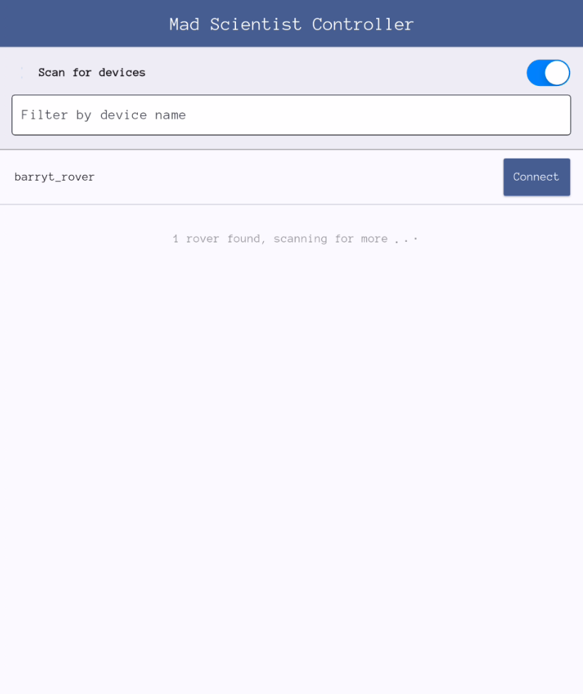
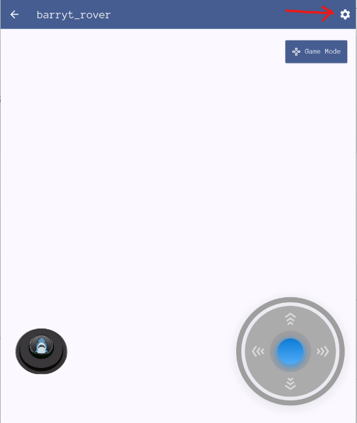
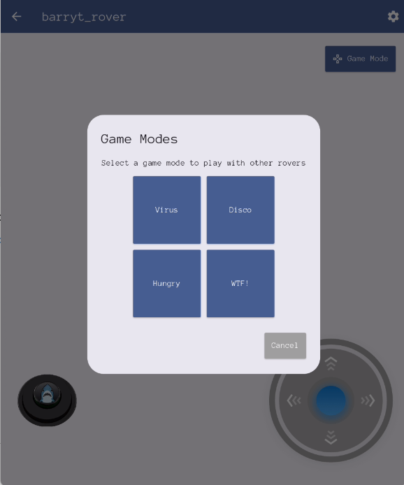
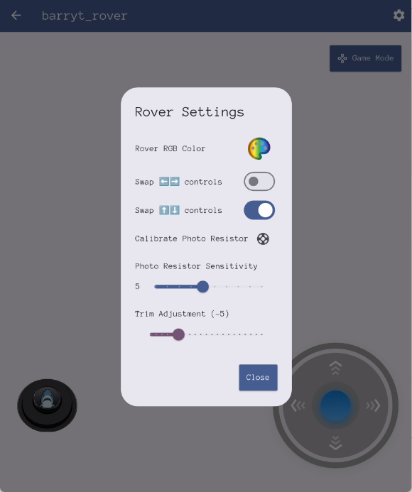

# Mad Scientist App

An app to control the Shark Rover as built by the [Mad Scientist Lab](https://github.com/javaplus/MadScientist).

## Install  
### iOS
To install on Apple Products grab [Mad Scientist Controls](https://apps.apple.com/us/app/mad-scientist-controls/id6739670168) from the Apple Store.

### Android
For Android you need to side load the APK. You may need to modify your phone settings to allow installation via an APK.
To install an APK from an unknown source on Android (Android 8+), go to **Settings > Apps > Special access > Install unknown apps**, then select the app you'll use (like Chrome or a File Manager) and toggle "Allow from this source" on. Older Android versions used a single "Unknown sources" toggle in Security settings.   
Find our **Android APK** in [Releases](https://github.com/javaplus/mad_scientist_app/releases) . Just Grab the latest `app-release.apk`.

### Bluetooth enalbed PC
You can use a browser to control the rover as well, assuming your browser allows bluetooth control. This may require changing browser settings to allow this.
Here is the link to the web controls:
Web: https://javaplus.github.io/mad_scientist_app/index.html

## App Usage:

### Starting Screen

When you launch the Mad Scientist Controls app, it should start scanning for Shark Rovers via bluetooth so do make sure you allow the app to use your bluetooth.

  

If you don't see your rover in the list, give it a minute or two. If it still doesn't come up in the list, try turning the rover off and on again.  Also, check that the app has permissions to use Bluetooth.
Once you see your shark in the list, click the "Connect" button to the right of it's name.

### Main Screen 

Once connected, the main screen has a virtual joystick at the bottom right to move the shark rover.  The Joystick is proportional, that is, the further you move the stick the faster the rover will move.  So, for slow movement, just barely move the stick from the center position. For fastest movement drag the stick the furthest from the center.

At the bottom left, is the fire button (button with the shark head).  This button usually turns the laser on. Depending on the Game Mode selected, the fire button when pressed may fire the laser for a few seconds before automatically turning off.  However, the Game Mode selected ultimately controls what the fire button does.

### Game Menu

Game Modes can be changed by hitting the "Game Modes" button in the top right and then selecting the Game you want.

Game modes are described in the [Game Modes section](#game-modes).

### Settings

If you need to change the direction your shark goes when you use the virtual joystick or other settings, you can do that in the settings menu (Gear icon from Main screen)

  

### Game Modes

#### Virus
The "Virus" game starts your shark with blue eyes and moving at full speed.  When your shark is "hit", then your shark's eyes turn green like a zombie and then your movement is slowed.  The idea is that you have many sharks playing this game and they start out as "Not infected" and then you pick one or two sharks to be the "zombies" and they try to "infect" the others by shooting them.  The last shark left with blue eyes wins or when the time ends.  The non infected sharks can shoot and if they score a hit on a zombie shark, then it spins out of control for a second or two before being able to move again.  Any shot to a non infected shark turns it into a zombie.

#### Disco

Get ready to boogie! In this high-energy mode, getting tagged triggers a dazzling disco fever. Your shark will go into a spinning frenzy while your RGB lights erupt in a vibrant rave show. It's a party in the laser tag arena, even if you're temporarily out of the action. 

#### Hungry 

Currenty Not Implemented. Does nothing... Do NOT Recommend hitting this game mode... You probably still will try, but, hey, at least we warned you. 

#### WTF

WTF Mode - "Whatever the fantastic" idea is you have for a game mode can go here! If you edit the [wtfgame.py](https://github.com/javaplus/MadScientist/blob/main/code/wtfgame.py) file in your Shark, then it will run that code when you switch to the WTF game mode.
Learn how to edit the game modes by looking a the [Game mode tutorial](https://github.com/javaplus/MadScientist/blob/main/lessons/game_mode_coding.md). 

## Administrative stuff:

- [Release Instructions](https://github.com/javaplus/mad_scientist_app/wiki/Releasing)
